# 📊 Example Voting App — GitOps with Argo CD & Kubernetes

<div align="center">


[](LICENSE)
[](https://kubernetes.io/)
[](https://argoproj.github.io/cd/)
[](https://www.docker.com/)
[](https://helm.sh/)

### 🚀 A Production-Ready GitOps Implementation

**Transform your Kubernetes deployments with automated, declarative infrastructure**

[Features](#-features) • [Quick Start](#-quick-start) • [Architecture](#%EF%B8%8F-architecture) • [Installation](#-installation-guide) • [Documentation](#-documentation)

</div>

---

## 🎯 What is This Project?

This repository demonstrates a **complete end-to-end GitOps workflow** for deploying a microservices application on Kubernetes using **Argo CD**. Built on top of Docker's popular Example Voting App, it showcases enterprise-grade practices for modern cloud-native deployments.

<div align="center">

### ⚡ From Code to Production in Minutes

```mermaid
graph LR
    A[👨‍💻 Developer] -->|git push| B[📦 GitHub]
    B -->|webhook| C[🔄 Argo CD]
    C -->|auto-sync| D[☸️ Kubernetes]
    D -->|deploy| E[🚀 Production]
```



</div>

---

## ✨ Features

<table>
<tr>
<td width="50%">

### 🎨 **Modern GitOps Workflow**
- ✅ Fully automated deployments
- ✅ Declarative infrastructure as code
- ✅ Self-healing applications
- ✅ Automatic rollback on failures

</td>
<td width="50%">

### 🔒 **Enterprise Security**
- ✅ Secrets management best practices
- ✅ RBAC & Network Policies
- ✅ Image scanning & validation
- ✅ Audit logging enabled

</td>
</tr>
<tr>
<td width="50%">

### 🌍 **Multi-Environment Support**
- ✅ Development environment
- ✅ Staging environment
- ✅ Production environment
- ✅ Kustomize overlays

</td>
<td width="50%">

### 📊 **Production Ready**
- ✅ High availability setup
- ✅ Horizontal pod autoscaling
- ✅ Monitoring & alerting
- ✅ CI/CD integration

</td>
</tr>
</table>

---

## 🏗️ Architecture
# 🏗️ Architecture

<div align="center">

## 📐 Application Architecture

</div>

### System Overview

A **microservices-based voting application** managed through **GitOps** with Argo CD for automated deployments.

---

### 🎨 Architecture Diagram

```mermaid
graph TB
    subgraph Frontend
        A[👤 User]
        B[🗳️ Vote UI - Python/Flask]
        F[📊 Results UI - Node.js]
    end
    
    subgraph Backend
        C[📦 Redis Queue]
        D[⚙️ Worker - .NET Core]
        E[🗄️ PostgreSQL Database]
    end
    
    subgraph GitOps
        G[📁 Git Repository]
        H[🔄 Argo CD]
    end
    
    A -->|Vote| B
    B -->|Queue| C
    C -->|Process| D
    D -->|Store| E
    E -->|Display| F
    A -->|View| F
    
    G -.->|Sync| H
    H -.->|Deploy| B
    H -.->|Deploy| C
    H -.->|Deploy| D
    H -.->|Deploy| E
    H -.->|Deploy| F
```



---

### 📊 Data Flow


---

### 🔄 GitOps Workflow

```mermaid
graph LR
    A[👨‍💻 Developer] -->|git push| B[📦 GitHub]
    B -->|webhook| C[🔄 Argo CD]
    C -->|sync| D[☸️ Kubernetes]
    D -->|deploy| E[🚀 Application]
```



---

### 🎯 Component Details

| Component | Tech Stack | Purpose | Exposure | Port |
|-----------|-----------|---------|----------|------|
| **🗳️ Vote UI** | Python/Flask | Cast votes for Cats or Dogs | LoadBalancer | 5000 |
| **📊 Results UI** | Node.js/Express | Display real-time results | LoadBalancer | 5001 |
| **⚙️ Worker** | .NET Core | Process votes from queue | Internal | - |
| **📦 Redis** | Redis 7 | Message queue/cache | ClusterIP | 6379 |
| **🗄️ PostgreSQL** | PostgreSQL 15 | Persistent data storage | ClusterIP | 5432 |
| **🔄 Argo CD** | Argo CD 2.9+ | GitOps automation | LoadBalancer | 443 |

---

### 🌐 Network Flow

**Vote Submission:**
```
User → Load Balancer → Vote UI Pod → Redis Queue → Worker Pod → PostgreSQL
```

**Results Display:**
```
User → Load Balancer → Results UI Pod → PostgreSQL → Real-time WebSocket Updates
```

**GitOps Deployment:**
```
Git Push → GitHub → Argo CD Controller → Kubernetes API → Deploy/Update Pods
```

---

### 🔒 Security Layers

```mermaid
graph TB
    A[🔐 TLS/HTTPS Ingress]
    B[🛡️ Network Policies]
    C[🔑 RBAC]
    D[🔒 Secrets Management]
    E[🏷️ Pod Security Standards]
    F[🔍 Image Scanning]
    
    A --> B --> C --> D --> E --> F
```



**Security Features:**
- 🔐 TLS/HTTPS for all external access
- 🛡️ Network Policies restrict pod-to-pod traffic
- 🔑 RBAC with least-privilege access
- 🔒 Sealed Secrets for credential management
- 🏷️ Pod Security Standards enforced
- 🔍 Container image scanning in CI/CD

---

### 📈 High Availability Setup (Production)

```mermaid
graph TB
    LB[⚖️ Load Balancer]
    
    subgraph AZ1[Availability Zone 1]
        V1[🗳️ Vote-1]
        R1[📊 Result-1]
        W1[⚙️ Worker-1]
    end
    
    subgraph AZ2[Availability Zone 2]
        V2[🗳️ Vote-2]
        R2[📊 Result-2]
        W2[⚙️ Worker-2]
    end
    
    subgraph AZ3[Availability Zone 3]
        V3[🗳️ Vote-3]
        R3[📊 Result-3]
    end
    
    subgraph Stateful[Stateful Services]
        REDIS[📦 Redis Sentinel - 3 Nodes]
        PG[🗄️ PostgreSQL Primary + Replicas]
    end
    
    LB --> V1 & V2 & V3
    LB --> R1 & R2 & R3
    
    V1 & V2 & V3 --> REDIS
    W1 & W2 --> REDIS
    W1 & W2 --> PG
    R1 & R2 & R3 --> PG
```



**HA Configuration:**
- ✅ **Vote/Result UI**: 3+ replicas across availability zones
- ✅ **Worker**: 2+ replicas for parallel processing
- ✅ **Redis**: Sentinel mode with 3 nodes for failover
- ✅ **PostgreSQL**: Primary-replica with streaming replication
- ✅ **HPA**: Horizontal Pod Autoscaler based on CPU/memory
- ✅ **PDB**: Pod Disruption Budgets ensure availability during updates

---

### 🎯 Key Design Decisions

| Decision | Rationale |
|----------|-----------|
| **Redis for Queue** | Fast, in-memory, pub/sub support, battle-tested |
| **PostgreSQL for Storage** | ACID compliance, reliability, rich ecosystem |
| **Separate Worker Process** | Decouples vote collection from processing |
| **GitOps with Argo CD** | Declarative config, automated sync, audit trail |
| **StatefulSet for PostgreSQL** | Stable network identity, ordered deployment |
| **Deployments for Stateless Apps** | Easy horizontal scaling, rolling updates |

---

### 📦 Kubernetes Resources

**Per Component:**

| Component | Deployment Type | Replicas (Prod) | Storage |
|-----------|----------------|-----------------|---------|
| Vote UI | Deployment | 3 | None |
| Results UI | Deployment | 3 | None |
| Worker | Deployment | 2 | None |
| Redis | Deployment | 3 (Sentinel) | Optional PVC |
| PostgreSQL | StatefulSet | 1 Primary + 2 Replicas | 10Gi PVC |

---

**This architecture provides:**

✅ **Scalability** - Horizontal scaling for all stateless components  
✅ **Reliability** - Data persistence and message queue buffering  
✅ **Maintainability** - Clear separation of concerns  
✅ **Security** - Multi-layer security approach  
✅ **Observability** - Structured logging and metrics

### 🎯 Component Overview

| Component | Technology | Purpose | Exposure |
|-----------|-----------|---------|----------|
| **🗳️ Vote UI** | Python (Flask) | Cast your vote for Cats 🐱 or Dogs 🐶 | `LoadBalancer` |
| **📊 Result UI** | Node.js (Express) | Real-time voting results | `LoadBalancer` |
| **⚙️ Worker** | .NET Core | Process votes from queue to database | `Internal` |
| **📦 Redis** | Redis 7+ | In-memory message queue | `ClusterIP` |
| **🗄️ PostgreSQL** | PostgreSQL 15+ | Persistent storage for votes | `ClusterIP` |

---

## 🎬 Demo

<div align="center">

### 🗳️ Voting Interface


### 📊 Real-time Results


### 🔄 Argo CD Dashboard


</div>

---

## 📂 Repository Structure

```
📦 voting-app-gitops/
│
├── 📁 argo-cd/                          # Argo CD Configuration
│   ├── 📄 application.yaml              # Main Argo CD Application
│   ├── 📄 project.yaml                  # Argo CD Project definition
│   ├── 📄 app-of-apps.yaml              # Multi-environment pattern
│   └── 📄 README.md                     # Argo CD setup guide
│
├── 📁 k8s/                              # Kubernetes Manifests
│   ├── 📁 base/                         # Base configurations
│   │   ├── 📁 vote/
│   │   │   ├── deployment.yaml
│   │   │   ├── service.yaml
│   │   │   ├── configmap.yaml
│   │   │   └── kustomization.yaml
│   │   ├── 📁 result/
│   │   ├── 📁 worker/
│   │   ├── 📁 redis/
│   │   └── 📁 postgres/
│   │       ├── statefulset.yaml
│   │       ├── service.yaml
│   │       └── pvc.yaml
│   │
│   └── 📁 overlays/                     # Environment-specific
│       ├── 📁 dev/
│       │   ├── kustomization.yaml
│       │   └── patches/
│       ├── 📁 staging/
│       └── 📁 production/
│           ├── kustomization.yaml
│           ├── hpa.yaml
│           └── ingress.yaml
│
├── 📁 charts/                           # Helm Charts (Optional)
│   └── 📁 voting-app/
│       ├── Chart.yaml
│       ├── values.yaml
│       └── templates/
│
├── 📁 .github/
│   └── 📁 workflows/
│       ├── ci.yaml                      # Build & Test
│       ├── security-scan.yaml           # Trivy scanning
│       └── gitops-sync.yaml             # Trigger Argo sync
│
├── 📁 docs/                             # Documentation
│   ├── 📄 INSTALLATION.md
│   ├── 📄 ARCHITECTURE.md
│   ├── 📄 DEPLOYMENT.md
│   ├── 📄 TROUBLESHOOTING.md
│   └── 📁 images/
│
├── 📁 scripts/                          # Utility scripts
│   ├── setup-cluster.sh
│   ├── install-argocd.sh
│   └── cleanup.sh
│
├── 📄 .gitignore
├── 📄 LICENSE
├── 📄 docker-compose.yaml               # Local development
└── 📄 README.md                         # You are here! 👋
```

---

## 🚀 Quick Start

<div align="center">

### ⚡ Get Up and Running in 5 Minutes

</div>

### Prerequisites

Before you begin, ensure you have:

```bash
✅ Kubernetes cluster (v1.24+)
✅ kubectl installed and configured
✅ Helm 3.x installed
✅ Git installed
```

### 🎯 Installation in 3 Steps

<details open>
<summary><b>Step 1️⃣: Clone the Repository</b></summary>

```bash
git clone https://github.com/sujalkamanna/example-voting-app.git
cd voting-app-gitops
```

</details>

<details open>
<summary><b>Step 2️⃣: Install Argo CD</b></summary>

```bash
# Run the automated installation script
./scripts/install-argocd.sh

# OR manually install
kubectl create namespace argocd
helm repo add argo https://argoproj.github.io/argo-helm
helm repo update
helm install argocd argo/argo-cd --namespace argocd
```

</details>

<details open>
<summary><b>Step 3️⃣: Deploy the Application</b></summary>

```bash
# Apply the Argo CD application manifest
kubectl apply -f argo-cd/application.yaml

# Watch the deployment
kubectl get pods -n voting -w
```

</details>

### 🎉 Access Your Application

```bash
# Get the Vote UI URL
kubectl get svc vote -n voting

# Get the Results UI URL
kubectl get svc result -n voting
```

**Or use port-forwarding for quick access:**

```bash
kubectl port-forward svc/vote 5000:5000 -n voting &
kubectl port-forward svc/result 5001:5001 -n voting &
```

<div align="center">

🗳️ **Vote:** http://localhost:5000  
📊 **Results:** http://localhost:5001

</div>

---

## 📖 Installation Guide

<details>
<summary><b>🛠️ Detailed Argo CD Installation</b></summary>

### Step 1: Install Helm

```bash
curl -fsSL -o get_helm.sh https://raw.githubusercontent.com/helm/helm/main/scripts/get-helm-3
chmod 700 get_helm.sh
./get_helm.sh
helm version
```

### Step 2: Add Argo Helm Repository

```bash
helm repo add argo https://argoproj.github.io/argo-helm
helm repo update
helm search repo argo-cd
```

### Step 3: Install Argo CD

```bash
kubectl create namespace argocd
helm install argocd argo/argo-cd --namespace argocd

# Verify installation
kubectl get pods -n argocd
```

### Step 4: Expose Argo CD Server

**Option A: LoadBalancer (Cloud)**
```bash
kubectl patch svc argocd-server -n argocd -p '{"spec": {"type": "LoadBalancer"}}'
kubectl get svc argocd-server -n argocd
```

**Option B: Port Forwarding (Local)**
```bash
kubectl port-forward svc/argocd-server -n argocd 8080:443
```

### Step 5: Get Admin Password

```bash
kubectl -n argocd get secret argocd-initial-admin-secret \
  -o jsonpath="{.data.password}" | base64 -d; echo
```

### Step 6: Login to Argo CD

**Web UI:**
- URL: https://localhost:8080 (or LoadBalancer IP)
- Username: `admin`
- Password: (from step 5)

**CLI:**
```bash
# Install Argo CD CLI
brew install argocd  # macOS
# OR
curl -sSL -o argocd https://github.com/argoproj/argo-cd/releases/latest/download/argocd-linux-amd64
sudo install -m 555 argocd /usr/local/bin/argocd

# Login
argocd login localhost:8080
```

### Step 7: Change Default Password

```bash
argocd account update-password
```

### Step 8: Delete Initial Secret

```bash
kubectl -n argocd delete secret argocd-initial-admin-secret
```

</details>

---

## ⚙️ Configuration

### 🌍 Environment Management

This project uses **Kustomize overlays** for environment-specific configurations:

<table>
<tr>
<th>Environment</th>
<th>Path</th>
<th>Features</th>
</tr>
<tr>
<td>

**🔧 Development**

</td>
<td>

`k8s/overlays/dev`

</td>
<td>

- Minimal resources
- Debug logging enabled
- Single replica
- No persistence

</td>
</tr>
<tr>
<td>

**🧪 Staging**

</td>
<td>

`k8s/overlays/staging`

</td>
<td>

- Production-like config
- 2 replicas
- Persistent volumes
- Resource limits

</td>
</tr>
<tr>
<td>

**🚀 Production**

</td>
<td>

`k8s/overlays/production`

</td>
<td>

- High availability (3+ replicas)
- Auto-scaling (HPA)
- Ingress with TLS
- Monitoring enabled

</td>
</tr>
</table>

### 📝 Example: Deploy to Production

```bash
# Update Argo CD application to use production overlay
kubectl apply -f - <<EOF
apiVersion: argoproj.io/v1alpha1
kind: Application
metadata:
  name: voting-app-prod
  namespace: argocd
spec:
  project: default
  source:
    repoURL: https://github.com/YOUR_USERNAME/voting-app-gitops.git
    targetRevision: main
    path: k8s/overlays/production
  destination:
    server: https://kubernetes.default.svc
    namespace: voting-prod
  syncPolicy:
    automated:
      prune: true
      selfHeal: true
    syncOptions:
      - CreateNamespace=true
EOF
```

---

## 🔄 GitOps Workflow

```mermaid
sequenceDiagram
    participant Dev as 👨‍💻 Developer
    participant Git as 📦 GitHub
    participant Argo as 🔄 Argo CD
    participant K8s as ☸️ Kubernetes
    participant App as 🚀 Application

    Dev->>Git: git push (update manifests)
    Git->>Argo: Webhook trigger
    Argo->>Git: Pull latest changes
    Argo->>Argo: Compare desired vs actual state
    Argo->>K8s: Apply changes
    K8s->>App: Rolling update
    App-->>Argo: Health check
    Argo-->>Dev: Deployment status
```

<div align="center">



</div>

### 🎯 Automated GitOps Features

| Feature | Description | Status |
|---------|-------------|--------|
| **Auto-Sync** | Automatically deploy when Git changes | ✅ Enabled |
| **Self-Heal** | Revert manual kubectl changes | ✅ Enabled |
| **Prune** | Remove resources deleted from Git | ✅ Enabled |
| **Rollback** | Automatic rollback on health check failure | ✅ Enabled |

### 📋 Sync Policy Configuration

```yaml
syncPolicy:
  automated:
    prune: true        # Delete resources removed from Git
    selfHeal: true     # Revert manual changes
  syncOptions:
    - CreateNamespace=true
    - PruneLast=true
  retry:
    limit: 5
    backoff:
      duration: 5s
      factor: 2
      maxDuration: 3m
```

---

## 🔒 Security Best Practices

<div align="center">

### 🛡️ Multi-Layer Security Approach

</div>

### 🔐 Secrets Management

```bash
# Using Sealed Secrets (Recommended)
kubectl create secret generic postgres-secret \
  --from-literal=password=YourSecurePassword \
  --dry-run=client -o yaml | \
  kubeseal -o yaml > postgres-sealed-secret.yaml

# Using External Secrets Operator
kubectl apply -f - <<EOF
apiVersion: external-secrets.io/v1beta1
kind: ExternalSecret
metadata:
  name: postgres-secret
spec:
  secretStoreRef:
    name: aws-secretsmanager
  target:
    name: postgres-secret
  data:
  - secretKey: password
    remoteRef:
      key: voting-app/postgres-password
EOF
```

### 🔒 Network Policies

```yaml
# Example: Restrict PostgreSQL access
apiVersion: networking.k8s.io/v1
kind: NetworkPolicy
metadata:
  name: postgres-netpol
  namespace: voting
spec:
  podSelector:
    matchLabels:
      app: postgres
  policyTypes:
  - Ingress
  ingress:
  - from:
    - podSelector:
        matchLabels:
          app: worker
    ports:
    - protocol: TCP
      port: 5432
```

### 🛡️ Security Checklist

- ✅ All secrets encrypted at rest
- ✅ Network policies applied
- ✅ RBAC enabled with least privilege
- ✅ Image scanning in CI pipeline
- ✅ Pod Security Standards enforced
- ✅ TLS enabled for all external services
- ✅ Regular security audits

---

## 📊 Monitoring & Observability

### 📈 Prometheus Metrics

```bash
# Apply ServiceMonitor for Prometheus
kubectl apply -f k8s/monitoring/servicemonitor.yaml
```

### 📊 Grafana Dashboards

Pre-configured dashboards available in `k8s/monitoring/dashboards/`:

- **Application Overview**: Request rates, latency, errors
- **PostgreSQL Metrics**: Connections, queries, replication lag
- **Redis Metrics**: Memory usage, commands/sec, hit rate
- **Argo CD Metrics**: Sync status, application health

### 🔍 Logging with Loki

```bash
helm repo add grafana https://grafana.github.io/helm-charts
helm install loki grafana/loki-stack \
  --namespace monitoring \
  --set promtail.enabled=true
```

---

## 🧪 Testing & Validation

### ✅ Pre-Deployment Tests

```bash
# Validate Kubernetes manifests
kubectl apply --dry-run=client -k k8s/overlays/production

# Lint with kubeval
kubeval k8s/base/**/*.yaml

# Security scan with kube-score
kube-score score k8s/base/**/*.yaml
```

### 🧪 Integration Tests

```bash
# Run integration test suite
./scripts/run-integration-tests.sh
```

---

## 🐛 Troubleshooting

<details>
<summary><b>🔴 Pods stuck in Pending state</b></summary>

```bash
# Check pod events
kubectl describe pod <pod-name> -n voting

# Common causes:
# - Insufficient resources
# - PVC binding issues
# - Node selector/affinity constraints

# Check node resources
kubectl top nodes
kubectl describe node <node-name>
```

</details>

<details>
<summary><b>🔴 Argo CD sync fails</b></summary>

```bash
# Check Argo CD application status
argocd app get voting-app

# View detailed logs
argocd app logs voting-app

# Force refresh
argocd app sync voting-app --force
```

</details>

<details>
<summary><b>🔴 Database connection errors</b></summary>

```bash
# Check PostgreSQL logs
kubectl logs -l app=postgres -n voting --tail=100

# Verify service connectivity
kubectl run test-pod --rm -i --tty --image=postgres:15 -- bash
# Inside pod:
psql -h postgres.voting.svc.cluster.local -U postgres
```

</details>

<details>
<summary><b>🔴 Can't access Argo CD UI</b></summary>

```bash
# Check service status
kubectl get svc argocd-server -n argocd

# Verify pods are running
kubectl get pods -n argocd

# Check logs
kubectl logs -n argocd deployment/argocd-server

# Test port-forward
kubectl port-forward svc/argocd-server -n argocd 8080:443
curl -k https://localhost:8080
```

</details>

See [TROUBLESHOOTING.md](docs/TROUBLESHOOTING.md) for more solutions.

---

## 🎓 Learning Resources

<div align="center">

### 📚 Expand Your Knowledge

</div>

| Topic | Resource | Type |
|-------|----------|------|
| **Argo CD Basics** | [Official Documentation](https://argo-cd.readthedocs.io/) | 📖 Docs |
| **GitOps Principles** | [OpenGitOps](https://opengitops.dev/) | 🌐 Website |
| **Kubernetes Patterns** | [kubernetes.io/docs](https://kubernetes.io/docs/) | 📖 Docs |
| **Kustomize Tutorial** | [kustomize.io](https://kustomize.io/) | 📖 Docs |
| **Argo CD YouTube** | [Playlist](https://www.youtube.com/c/ArgoProj) | 🎥 Video |

---

## 🤝 Contributing

We love contributions! 💖

### How to Contribute

1. 🍴 **Fork** the repository
2. 🌿 **Create** a feature branch
   ```bash
   git checkout -b feature/amazing-feature
   ```
3. ✍️ **Commit** your changes
   ```bash
   git commit -m 'Add some amazing feature'
   ```
4. 📤 **Push** to the branch
   ```bash
   git push origin feature/amazing-feature
   ```
5. 🎉 **Open** a Pull Request

### 📋 Contribution Guidelines

- Follow existing code style
- Add tests for new features
- Update documentation
- Sign commits with GPG

---

## 📜 License

This project is licensed under the **Apache License 2.0** - see [LICENSE](LICENSE) for details.

```
Copyright 2024 to Respective Owners

Licensed under the Apache License, Version 2.0 (the "License");
you may not use this file except in compliance with the License.
```

---

## 🙏 Acknowledgments

<div align="center">

Special thanks to:

**🐳 [Docker, Inc.](https://www.docker.com/)** - For the original Example Voting App  
**🚀 [Argo Project](https://argoproj.github.io/)** - For Argo CD  
**☸️ [CNCF](https://www.cncf.io/)** - For Kubernetes and the cloud-native ecosystem  
**👥 [Open Source Community](https://github.com/)** - For continuous inspiration

</div>

---

## 📞 Support & Community

<div align="center">

### 💬 Get Help & Connect

[](https://github.com/YOUR_USERNAME/voting-app-gitops/issues)
[](https://github.com/YOUR_USERNAME/voting-app-gitops/discussions)
[](https://argoproj.github.io/community/join-slack)
[](https://twitter.com/YOUR_HANDLE)

</div>

---

## 📊 Project Stats

<div align="center">


</div>

---

## 🗺️ Roadmap

- [x] Basic Argo CD integration
- [x] Multi-environment support
- [x] Automated CI/CD pipeline
- [ ] Helm chart support
- [ ] Progressive delivery with Argo Rollouts
- [ ] Service mesh integration (Istio/Linkerd)
- [ ] Advanced monitoring with Prometheus/Grafana
- [ ] Disaster recovery automation
- [ ] Multi-cluster deployment

---

<div align="center">

### ⭐ Star this repository if it helped you!

**Made with ❤️ by the community**

---

**[⬆ Back to Top](#-example-voting-app--gitops-with-argo-cd--kubernetes)**

</div>
